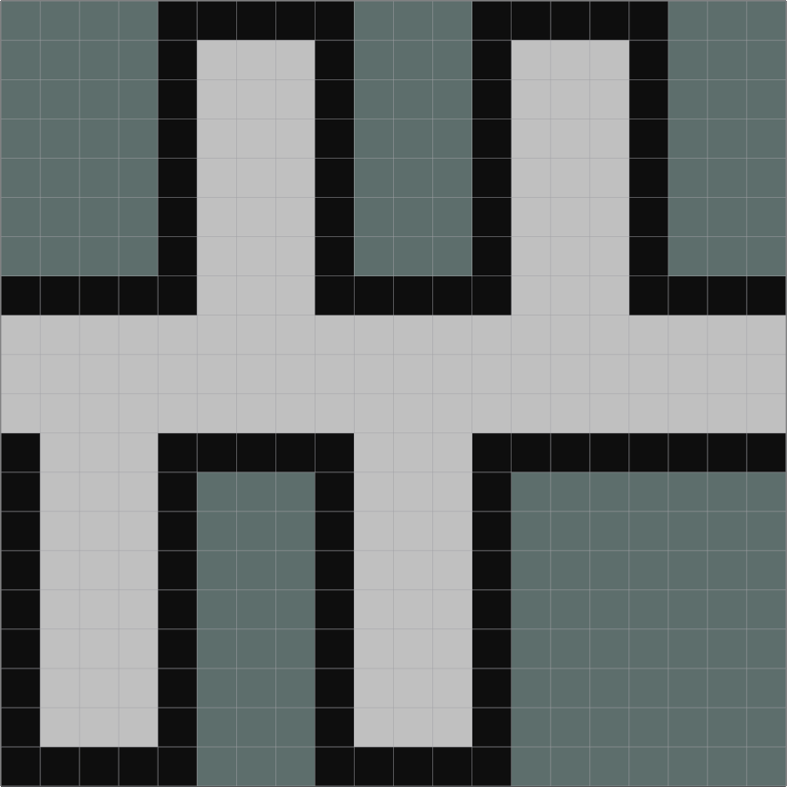
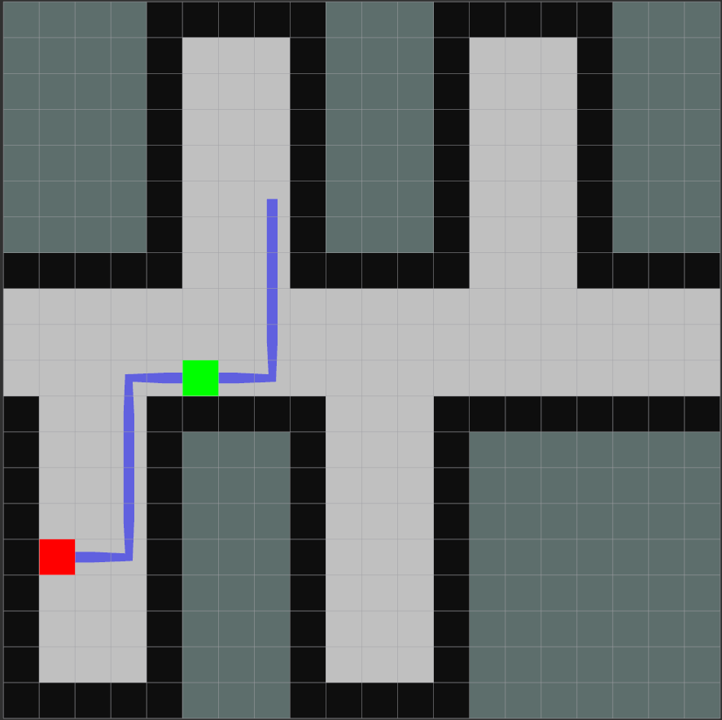

# Practical Course: Intelligent Mobile Robots with ROS (PCIMR)

## Tutorial 05: Path Planning & Control

The robot is able to localite more or less (he is jumping around a little more).
Adjust the meassurement Probabilites from 0.2 to 0.1, such that "nearly good results" are punished more and perfect 'scans' are rewared more. It helps a little

The purpose of this tutorial is to demonstrate an understanding of search algorithms, i.e. global path planners and how to implement one efficiently. You can solve the tasks using either C++ or Python.
After completing this exercise you should be able to
- understand and implement a global path planner for mobile robots
- understand how A* works and how it is implemented, including to know 
  - why A* is more efficient than e.g. Dijkstra 
  - what a heuristic is

If you have trouble understanding the code or writing your own, please have a look at the [tutorials](http://wiki.ros.org/ROS/Tutorials)  again.

---
### Code Overview

Visit the provided github repository and have a look at the code for the exercise by checking out the branch *tutorial-05*. You will find the same simulator used in previous exercises but with a few modifications. You can choose to work with any of the worlds provided, e.g. the one from tutorial-03, shown in Fig.1.

This time we provide a launch file in the *pcimr_navigation* package

    roslaunch pcimr_navigation navigation.launch

for starting up the simulation and a mover node, which listens to a path on the */global_path* topic and publishes on */move*.

The simulator publishes a map as well as the robots position and its sensor readings (not necessary for this exercise). 

<table style="margin-left: auto; margin-right: auto; table-layout: fixed; width: 100%">
  <tr>
    <td style="width: 48%;"> </td>
    <td style="width: 48%;"> </td>
  </tr>
  <tr>
    <td style="width: 48%;" valign="top"> <b>Fig.1:</b> Grid-world for this exercise, grey pixels are free space, black ones are occupied and grey/green ones are unknown.
    </td>
    <td style="width: 48%;" valign="top">  <b>Fig.2:</b> An example path calculated for the start (green)/goal (red).
    </td>
  </tr>
</table>

---
### Exercise 

Your task is to implement the A* algorithm from this lecture. You will find a lot of implementations online, please still try to implement it on your own. 

Write a node in the pcimr_navigation package that listens to the robot position and the map as well as a goal published by rviz. With this information you calculate a path from the robots current position to the goal and publish it.

1. Fork and clone the updated ROS code, then checkout the new branch (tutorial-05). Create your own branch and start coding!
2. Now, implement a ROS node with two subscribers and three publishers.
   1. Subscribers receive the robot position (/robot_pos) and map (/map)from the simulator node and the goal (/move_base_simple/goal) from rviz (you need to discretize this goal and check if its valid).
   2. The publisher sends a nav_msgs/Path message on the topic /global_path including all cells the robot needs to pass from its current location to the goal. Publish this path only once with the option latch=True. The other two publishers, publish a [visualization_msgs/Marker](http://wiki.ros.org/rviz/DisplayTypes/Marker) for the goal (Cube) and the path (Line Strip).
   3. Implement the A* algorithm as efficiently as possible. Make sure that the algorithm always finds a path.
